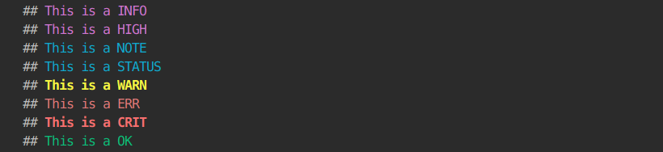
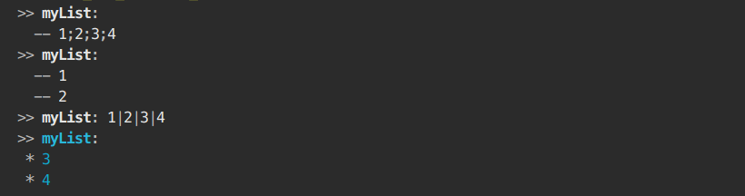
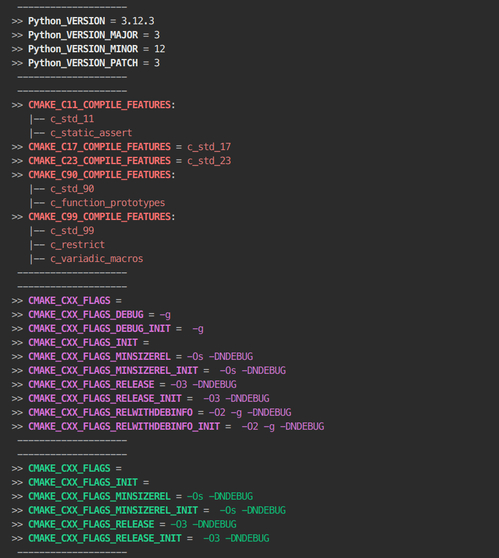
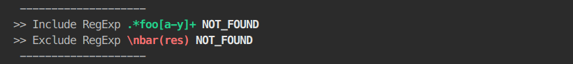
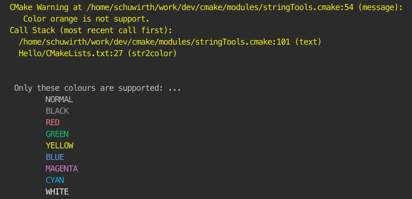

# CMake Utilities

A collection of usefull function for debugging CMake Projects

- [CMake Utilities](#cmake-utilities)
  - [How to use:](#how-to-use)
    - [utils:](#utils)
      - [`msg(<msg_type> <string>)`](#msgmsg_type-string)
      - [`print(<variable|list>...)`](#printvariablelist)
      - [`dump_variables(...)`](#dump_variables)
    - [stringUtils](#stringutils)
      - [`str2Color(<variable> COLOR <color> [BOLD])`](#str2colorvariable-color-color-bold)
      - [`toCamelCase(<variable|list> <out> [UPPER])`](#tocamelcasevariablelist-out-upper)
      - [`pathToCamelCase(<variable|string> <out> [UPPER])`](#pathtocamelcasevariablestring-out-upper)
      - [`shortPath(<variable|string> <out> [ALL])`](#shortpathvariablestring-out-all)
    - [propertyUtils](#propertyutils)
      - [`print_target_properties(<target> [COLOR <color>])`](#print_target_propertiestarget-color-color)


## How to use:

### utils:
#### `msg(<msg_type> <string>)`
```cmake
# outputs a colored Message according to <msg_type>:
# - HIGH: Magenta
# - NOTE: Cyan
# - OK:   Green
# - WARN: BoldYellow
# - ERR:  Red
# - CRIT: BoldRed
```
<details>

Example
```cmake
msg(INFO "This is a INFO")
msg(HIGH "This is a HIGH")
msg(NOTE "This is a NOTE")
msg(STATUS "This is a STATUS")
msg(WARN "This is a WARN")
msg(ERR "This is a ERR")
msg(CRIT "This is a CRIT")
msg(OK "This is a OK")
```
Output:



</details>

#### `print(<variable|list>...)`
```cmake
# prints variables without the need of dereferencing ${...}:
print(<variable> [COLOR <color>])
# or
print(
    <list>
    [NUM <num_values_shown>]
    [GLUE <glue_string>]
    [COLOR <color>]
    [BREAK])
```

<details>

Example variable:
```cmake

set(myString "This is a string")
set(myBool TRUE)
set(myEmpty)
print(myString)
print(myBool)
print(myEmpty)
print(myNotExistentVar)
print(CMAKE_CXX_COMPILER_ID COLOR yellow)
```


Example List:
```cmake
set(myList 1 2 3 4 )
print(myList)
print(myList NUM 2 BREAK)
print(myList GLUE "|")
print(myList NUM -2 GLUE " * " BREAK COLOR cyan)
```
output:



</details>

#### `dump_variables(...)`

```cmake
# print ALL variables
dump_variables(
    [<regexp_include>] 
    [<regexp_exclude>]
    [NUM <num_values_shown>]
    [GLUE <glue_string>]
    [BREAK]
    [COLOR <color>])
```

<details>

Example:
```cmake
find_package(Python)
dump_variables(VERSION "(^_|CM(AKE|ake))")
dump_variables("C[0-9].*FEATURES" NUM 50 COLOR red GLUE "   |-- "  BREAK)

dump_variables("CMAKE_CXX_FLAGS" COLOR magenta )
dump_variables("CMAKE_CXX_FLAGS" ".*DEB.*" COLOR green )

dump_variables(".*foo[a-y]+" "\\nbar(res)")
```
Output




</details>

### stringUtils

#### `str2Color(<variable> COLOR <color> [BOLD])`

Takes a `<variable>` (containing a string) and converts its content to a colored string
```cmake
# Usage:
str2color(
  <variable>
  COLOR <color>
  [BOLD])
```

<details>

Example:

```cmake
str2color( COLOR orange CMAKE_BUILD_TYPE BOLD)
```


</details>

#### `toCamelCase(<variable|list> <out> [UPPER])`

concatenates the given `<list>` to a lower case CamelCase string
```cmake
# Usage:
toCamelCase(<variable|list> <out> [UPPER])
```
<details>

```cmake
set(input_list this is an unconventional LIST of words)
toCamelCase(input_list output_variable_1)
toCamelCase(input_list output_variable_2 UPPER)
toCamelCase("This;is;an;unconventional;LIST;of;words" output_variable_3)
toCamelCase(this is an unconventional LIST of words output_variable_4)
message("1: ${output_variable_1}")
message("2: ${output_variable_2}")
message("3: ${output_variable_3}")
message("4: ${output_variable_4}")
```

result:
```txt
1: thisIsAnUnconventionalListOfWords
2: ThisIsAnUnconventionalListOfWords
3: thisIsAnUnconventionalListOfWords
4: thisIsAnUnconventionalListOfWords
```
</details>

#### `pathToCamelCase(<variable|string> <out> [UPPER])`

Converts the given path `<string>` to a camelCase string by converting it to a folder list and using the `toCamelCase(...)` funciton
```cmake
# Usage:
pathToCamelCase(
  <variable|string>
  <out>
  [UPPER])
```
<details>

```cmake

set(myPath CMakePowerUser/Documents/development)
pathToCamelCase(myPath output_variable_1)
pathToCamelCase(CMakePowerUser/Documents/development output_variable_2)
pathToCamelCase(CMakePowerUser/Documents/development output_variable_3 UPPER)
message("1: ${output_variable_1}")
message("2: ${output_variable_2}")
message("3: ${output_variable_3}")
```
```txt
1: cmakepoweruserDocumentsDevelopment
2: cmakepoweruserDocumentsDevelopment
3: CmakepoweruserDocumentsDevelopment
```

</details>

#### `shortPath(<variable|string> <out> [ALL])`

replace `$HOME`/(windows?) directory by '~'

`ALL`: shortens every folder name to three letters except the last one

    example: /home/<user>/my/nicest/folder
        ->  ~/my/nic…/folder

    example: /home/<user>/my/nicest/places/to/file.log
        ->  ~/my/nic…/pla…/to/file.log

```cmake
# Usage:
shortPath(
  <variable|string>
  <out>
  [ALL])
```
<details>

```cmake
shortPath("/home/CMakePowerUser/Documents/development/magical_project_environment/cmake_modules" output_variable_1)
shortPath("./Documents/development/magical_project_environment/cmake_modules" output_variable_2)
shortPath("Documents/development/magical_project_environment/cmake_modules" output_variable_3)
shortPath("C:\Programm Files\Kitware\CMake" output_variable_4 ALL)
shortPath("C:\Programm Files\Kitware\CMake" output_variable_5)
shortPath("C:\Users\CMakePowerUser\Documents\development\magical_project_environment\cmake_modules" output_variable_6)
shortPath("C:\Users\CMakePowerUser\Documents\development\magical_project_environment\cmake_modules" output_variable_7 ALL)
message("1: ${output_variable_1}")
message("2: ${output_variable_2}")
message("3: ${output_variable_3}")
message("4: ${output_variable_4}")
message("5: ${output_variable_5}")
message("6: ${output_variable_6}")
message("7: ${output_variable_7}")
```
```txt o
1: ~/Documents/development/magical_project_environment/cmake_modules
2: ./Documents/development/magical_project_environment/cmake_modules
3: Documents/development/magical_project_environment/cmake_modules
4: C:/Pro…/Kit…/CMake
5: C:/Programm Files/Kitware/CMake
6: ~/Documents/development/magical_project_environment/cmake_modules
7: ~/Doc…/dev…/mag…/cmake_modules
```
</details>

### propertyUtils
#### `print_target_properties(<target> [COLOR <color>])`
Prints all properties **set** on `<target>` form `CMAKE_PROPERTY_LIST` as colored list.

*_Note_: Not-set properties will not be listed. <br>Variables set to an empty string will still be shown. <br/>See example*
```cmake
# usage:
print_target_properties(
  <target>
  [COLOR <color>]
  )
```

<details>

See file: `test/Hello/CMakeLists.txt`

```cmake
add_library (HelloWorld
  HelloWorld.cpp)

target_include_directories(HelloWorld PUBLIC ${CMAKE_CURRENT_SOURCE_DIR})

install (TARGETS HelloWorld DESTINATION bin)
install (FILES HelloWorld.h DESTINATION include)

print_target_properties(HelloWorld COLOR green)
```

```
>> HelloWorld AUTOGEN_ORIGIN_DEPENDS = ON
>> HelloWorld AUTOMOC_COMPILER_PREDEFINES = ON
>> HelloWorld AUTOMOC_MACRO_NAMES = Q_OBJECT;Q_GADGET;Q_NAMESPACE;Q_NAMESPACE_EXPORT
>> HelloWorld AUTOMOC_PATH_PREFIX = OFF
>> HelloWorld BINARY_DIR = /home/CMakePowerUser/Documents/development/magical_project_environment/cmake_modules/test/build/Hello
>> HelloWorld BUILD_WITH_INSTALL_RPATH = OFF
>> HelloWorld CXX_MODULE_SETS = 
>> HelloWorld EXPORT_COMPILE_COMMANDS = 
>> HelloWorld HEADER_SETS = 
>> HelloWorld IMPORTED = FALSE
>> HelloWorld IMPORTED_GLOBAL = FALSE
>> HelloWorld INCLUDE_DIRECTORIES = /home/CMakePowerUser/Documents/development/magical_project_environment/cmake_modules/test/Hello
>> HelloWorld INSTALL_RPATH = 
>> HelloWorld INSTALL_RPATH_USE_LINK_PATH = OFF
>> HelloWorld INTERFACE_CXX_MODULE_SETS = 
>> HelloWorld INTERFACE_HEADER_SETS = 
>> HelloWorld INTERFACE_INCLUDE_DIRECTORIES = /home/CMakePowerUser/Documents/development/magical_project_environment/cmake_modules/test/Hello
>> HelloWorld ISPC_HEADER_SUFFIX = _ispc.h
>> HelloWorld NAME = HelloWorld
>> HelloWorld PCH_INSTANTIATE_TEMPLATES = ON
>> HelloWorld PCH_WARN_INVALID = ON
>> HelloWorld SKIP_BUILD_RPATH = OFF
>> HelloWorld SOURCES = HelloWorld.cpp
>> HelloWorld SOURCE_DIR = /home/CMakePowerUser/Documents/development/magical_project_environment/cmake_modules/test/Hello
>> HelloWorld TYPE = STATIC_LIBRARY
>> HelloWorld UNITY_BUILD_BATCH_SIZE = 8
>> HelloWorld UNITY_BUILD_MODE = BATCH
```
</details>
