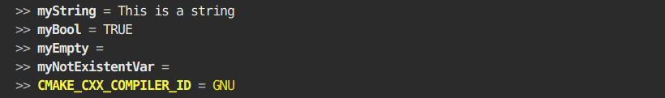

# CMake Utilities

A collection of usefull function for debugging CMake Projects

## How to use:

### utils:

#### `msg(<msg_type> <string>)`
```cmake
# outputs a colored Message according to <msg_type>:
# - HIGH: Magenta
# - NOTE: Cyan
# - OK:   Green
# - WARN: BoldYellow
# - ERR:  Red
# - CRIT: BoldRed
```
Example
```cmake
msg(INFO "This is a INFO")
msg(HIGH "This is a HIGH")
msg(NOTE "This is a NOTE")
msg(STATUS "This is a STATUS")
msg(WARN "This is a WARN")
msg(ERR "This is a ERR")
msg(CRIT "This is a CRIT")
msg(OK "This is a OK")
```
Output:


#### `print(<variable|list>...)`
```cmake
# prints variables without the need of dereferencing ${...}:
print(<variable> [COLOR <color>])
# or
print(
    <list>
    [NUM <num_values_shown>]
    [GLUE <glue_string>]
    [COLOR <color>]
    [BREAK])
```
Example variable:
```cmake

set(myString "This is a string")
set(myBool TRUE)
set(myEmpty)
print(myString)
print(myBool)
print(myEmpty)
print(myNotExistentVar)
print(CMAKE_CXX_COMPILER_ID COLOR yellow)
```

Example List:
```cmake
set(myList 1 2 3 4 )
print(myList)
print(myList NUM 2 BREAK)
print(myList GLUE "|")
print(myList NUM -2 GLUE " * " BREAK COLOR cyan)
```
output:


#### `dump_variables(...)`

```cmake
# print ALL variables
dump_variables(
    [<regexp_include>] 
    [<regexp_exclude>]
    [NUM <num_values_shown>]
    [GLUE <glue_string>]
    [BREAK]
    [COLOR <color>])
```
Example:
```cmake
find_package(Python)
dump_variables(VERSION "(^_|CM(AKE|ake))")
dump_variables("C[0-9].*FEATURES" NUM 50 COLOR red GLUE "   |-- "  BREAK)

dump_variables("CMAKE_CXX_FLAGS" COLOR magenta )
dump_variables("CMAKE_CXX_FLAGS" ".*DEB.*" COLOR green )

dump_variables(".*foo[a-y]+" "\\nbar(res)")
```
Output


### stringUtils

#### `str2Color(...)`

```cmake
str2color(COLOR <color> <variable> [BOLD] )
```
Example:

```cmake
str2color( COLOR orange CMAKE_BUILD_TYPE BOLD)
```

#### `toPascalCase(...)`

```cmake
#
# Usage:
toPascalCase(<variable|list> <out>)
```
#### `toCamelCase(...)`

```cmake
#
# Usage:
toCamelCase(<variable|list> <out>)
```
#### `pathToCamelCase(...)`

```cmake
#
# Usage:
pathToCamelCase(<variable|list> <out>)
```
#### `shortPath(...)`

```txt
replace home dir by '~'

ALL: shortens every folder name to three letters except the last one

     example: /home/<user>/my/nicest/folder
          ->  ~/my/nic…/folder

     example: /home/<user>/my/nicest/places/to/file.log
         ->  ~/my/nic…/pla…/to/file.log
```

```cmake
# Usage:
shortPath(<path|variable> <out> [ALL])
```
